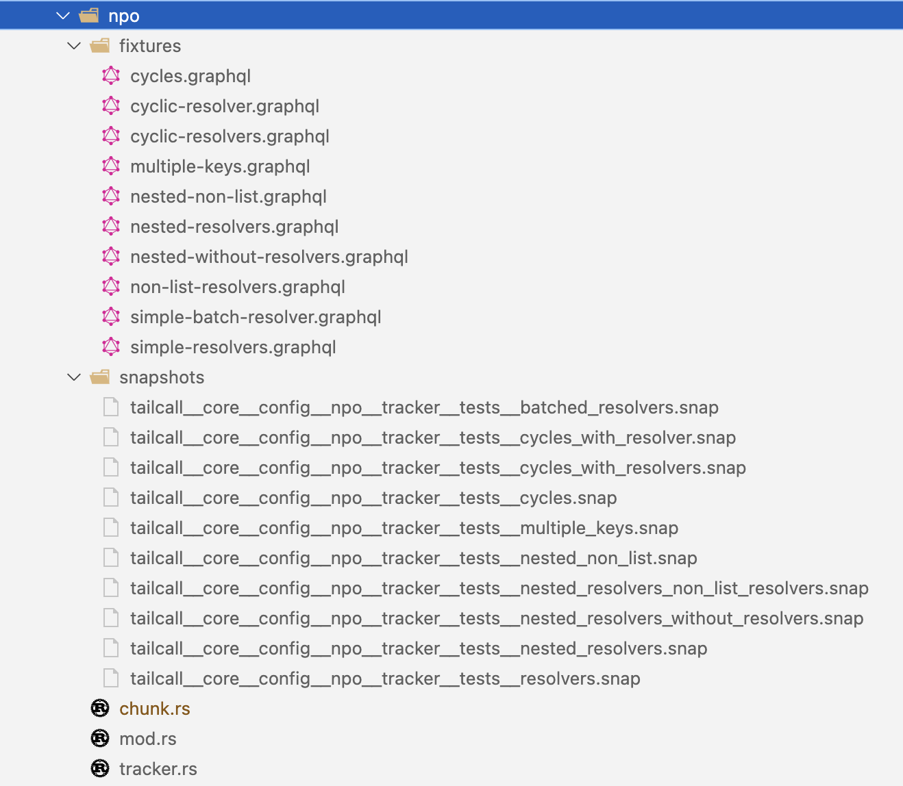

As a developer working with GraphQL, you're likely familiar with the concept of N+1 issues, if not you should definitely check out our [N+1 guide](../docs/N+1.md).

To summarize they occur when a GraphQL resolver is called multiple times for a single GraphQL request, leading a large set of requests upstream and overall a slower query execution. In this blog post, we'll dive into how Tailcall specifically identifies N+1 issues in GraphQL, and explore the algorithm and data structures used to detect these issues.


## High-Level Working

Unlike a traditional GraphQL implementation where the resolvers are written by hand Tailcall encourages developers to take a configuration-driven approach. This has many benefits and we have talked about them in our previous [blog](./no-code-graphql-2024-05-30.md). One of the main advantages of not handwriting is the ability to introspect and optimize. This means a configuration file can be parsed, validated and semantically analyzed to identify issues such as N+1 very precisely. With code, that's written in a general-purpose language if you wish to perform semantic analysis automatically you will need to depend on some sort of LLM solution and still it won't be as precise (at least today).

## The Algorithm

Tailcall reads your [configuration](../docs/configuration.mdx), parses it, and internally stores it in an efficient graph data-structure that resembles a `HashMap`. This allows `O(1)` access to a GraphQL type which represented as a node by its name. Once the graph data-structure is ready we make it go through a series of validators, one of them being the **N+1 tracker**.

:::tip
To see the actual implementation you can check out the [tracker.rs](https://github.com/tailcallhq/tailcall/blob/main/src/core/config/npo/tracker.rs) implementation.
:::

We essentially use a Depth-First Search (DFS) algorithm starting at the root query and traversing all the connected nodes. The algorithm works as follows:

1. Initialize a to variables to track the currently traversed path and visited fields so that we can avoid cycles.
2. Start at the root query and begin traversing the graph data structure.
3. For each field in the current node, check if it has a resolver and is not batched. We know if the node contains a resolver if that node has a [`@http`](../docs/directives.md#http-directive) or a [`@grpc`](../docs/directives.md#grpc-directive).

:::important
Tailcall supports powerful batching primitives and if a field uses a Batch API, then that resolver is whitelisted and dropped from the list of potential N+1 candidates.
:::

4. If the field has a resolver and is not batched, and the current path contains a list, then the current path is added to the result.
5. Otherwise, we recursively traverse the graph data structure, updating the current path and visited fields as necessary.
6. If a cycle is detected, return the cached result instead of re-traversing the path.
7. Once the traversal is complete, return the result, which represents the identified N+1 issues.

## Performance

While starting, Tailcall automatically performs these validations and one of our users complained that it would take around 5 minutes to start the server for their configuration which was around 10,000 lines. The thing is finding N+1 issues is a complex dynamic-programming problem. All this while our team has been focused on [benchmarking](https://github.com/tailcallhq/graphql-benchmarks) and optimizing the runtime performance of the server. This was the first time perhaps that we were surprised to see such a degradation in performance. We quickly realized that this a dynamic programming problem and there are certain tricks to make such algorithms efficient for us it was basically two things —

### 1. Memoization

Our algorithm uses a cache to store the results of previous traversals. The cache is used to avoid re-traversing the same path multiple times. It's essentially memoization however is super critical if you have a huge configuration that you'd want to validate.

### 2. Chunking

Our algorithm uses a special chunk data structure to store and manipulate the query paths. The chunk data structure is implemented as an enum with three variants:

```rust
enum Chunk<A> {
    Empty,
    Append(A, Rc<Chunk<A>>),
    Concat(Rc<Chunk<A>>, Rc<Chunk<A>>)
}

impl<A> Chunk<A> {
    pub fn new() -> Self {
        Self::Empty
    }

    pub fn is_null(&self) -> bool {
        matches!(self, Chunk::Empty)
    }

    pub fn append(self, a: A) -> Self {
        Chunk::Append(a, Rc::new(self))
    }

    pub fn concat(self, other: Chunk<A>) -> Self {
        if self.is_null() {
            return other;
        }
        if other.is_null() {
            return self;
        }
        Self::Concat(Rc::new(self), Rc::new(other))
    }

    pub fn as_vec(&self) -> Vec<&A> {
        // ... converts the chunk into a vec
    }
}
```

| **Variant** |                                                               |
| ----------- | ------------------------------------------------------------- |
| **Nil**     | Represents an empty chunk                                     |
| **Append**  | Represents an append operation performed on an existing chunk |
| **Concat**  | Represents the concatenation of two chunks                    |

The chunk data structure has the following properties:

- `O(1)` complexity for append and concat operations.
- Uses Reference Counting instead of Boxing to make cloning faster.
- Can be converted to a vector of references to the elements in the chunk.

You can clearly see that we don't actually perform an append or a concat operation instead we store a representation of that operation. This reduces the overall compute required especially while performing the concat operation.

## Conclusion

Lastly to ensure that we are always correct and no N+1 issues go unidentified we perform tests with actual configurations.



Hopefully, this gives some insight on how Tailcall identifies N+1 issues in your GraphQL configuration.

- If you think we can make our N+1 detection faster or better in some other way please help us improve by [contributing](https://github.com/tailcallhq/tailcall) 🙏
- If you find this interesting please spread the word 🙌
